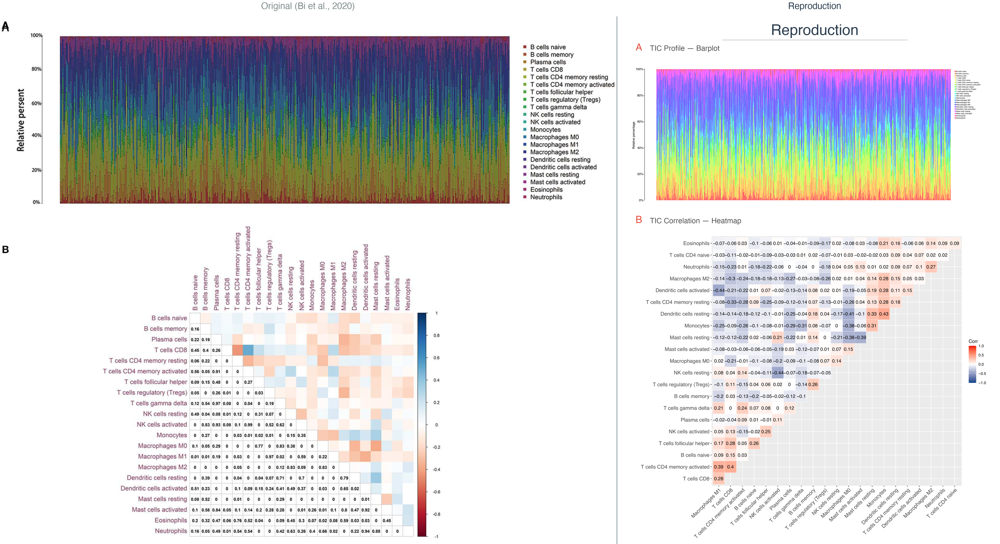

# TCGA-LUAD immune microenvironment analysis around BTK  -- artical reproduce project by wrc

<p align="center">
  
</p>

> **Figure 8 — CIBERSORT TIC Profile ： 原文 vs. 复现。
>
> *Original Figure 8 from Bi K-W, Wei X-G, Qin X-X, Li B. Front. Oncol. 2020;10:424. doi:10.3389/fonc.2020.00424*

---

## 从理论学习到生信实践：本科阶段基于 TCGA 的免疫微环境经典 pipeline 复现回顾整理

此仓库整理本人于大三上学期复现一篇生信文章的过程。  
展示思路是："这一步为什么要做？输入的数据长什么样？输出的结果怎么看？如果报错了如何排查？"。  
希望以此展示我生信学习的过程与已学到的科学技能与思维。  


## Pipeline Overview / 分析全流程拆解

本项目将全流程拆解为三个标准化模块，重点关注代码的可复用性与数据对齐的严谨性：

### 1. 上游预处理：数据清洗与临床对齐
* **矩阵清洗**：处理原始数据，得到 GDC 原生 Counts/TPM，严格区分 `01A` (肿瘤) 与 `11A` (正常)，执行 `log2(TPM+1)` 转化。
* **临床对齐**：合并表达矩阵与 OS/临床分期数据，脚本内置 TCGA Barcode 校验，防止错位匹配。

### 2. 中游核心分析：微环境打分与靶标锁定
* **宏观评分**：调用 `ESTIMATE` 计算 ImmuneScore、StromalScore 及 TumorPurity。
* **差异挖掘**：按评分中位数划定高低组，基于 `DESeq2` 独立执行双重差异分析，提取交集基因。
* **靶标锁定**：结合 GO/KEGG 富集、PPI 网络推断与单因素 COX 风险回归，最终筛出预后相关核心靶标 `BTK`。

### 3. 下游微环境验证：机制挖掘与交叉验证
* **临床验证**：多维度核查 `BTK` 表达特征（肿瘤 vs 正常、严格配对、不同分期）及其 K-M 生存预后指示效能。
* **免疫反卷积**：进行 `CIBERSORT` 量化 22 种免疫细胞占比，对比并刻画 `BTK` 高低组间的免疫微环境差异。


## Repository layout

```text
scripts/              # 按复现步骤拆开的 R 脚本
data_description/     # 数据来源和大文件说明
data/                 # 按照脚本流程整理的全部文件
results/tables/       # 流程中生成的的小型结果表
results/figures/      # 原始结果图和重绘结果图
notes/                # 复现过程中的笔记与思考
notes/github_update_plan  #分布整理并上传github的计划
session_info.txt      # 项目所使用的环境依赖          
```


## Data note

TCGA 表达矩阵文件比较大，流程文件臃肿，不适合上传GitHub。  
因此只上传了表达矩阵以外的原始文件 与 占位流程文件夹。  
完整数据来源和需要准备的文件见：

- `data_description/data_source.md`
- `data_description/large_files_note.md`


## How to run

建议在仓库根目录运行脚本：

```r
# 上游预处理
source("scripts/01_prepare_TCGA_data.R")
source("scripts/02_ESTIMATE_score.R")
source("scripts/03_survival_and_clinical.R")

# 中游核心分析
source("scripts/04_immune_score_deg.R")
source("scripts/05_stromal_score_deg.R")
source("scripts/06_shared_deg_enrichment.R")
source("scripts/07_ppi_network.R")
source("scripts/08_cox_screening.R")

# 下游靶标验证
source("scripts/09_btk_expression_clinical.R")
source("scripts/10_btk_deg_gsea.R")
source("scripts/11_cibersort_infiltration.R")
```

## Environment & Dependencies

本项目所有分析均基于 **R 4.6.0 (2026-04-24)** 完成，运行平台为 **macOS Sequoia (aarch64-apple-darwin23)**。核心分析包及用途归类如下：

| 类别 | 包 | 用途 |
|:--|:--|:--|
| 数据清洗与整合 | `tidyverse` | 全流程数据读写与变形 |
| 差异分析 | `DESeq2` | ImmuneScore / StromalScore / BTK 分组差异 |
| 生存分析 | `survival`, `survminer`, `forestplot` | COX 回归、K-M 曲线、森林图 |
| 富集与互作网络 | `clusterProfiler`, `org.Hs.eg.db`, `enrichplot` | GO / KEGG / GSEA |
| | `httr`, `jsonlite` | STRING API PPI 互作网络 |
| 微环境反卷积 | `estimate` | ESTIMATE 免疫/基质评分 |
| | `e1071`, `parallel`, `preprocessCore` | CIBERSORT 免疫浸润 |
| 核心可视化 | `ggplot2`, `pheatmap`, `ggpubr` | 热图、箱线图、火山图 |
| | `corrplot`, `ggcorrplot`, `ggsci`, `ggnewscale` | 相关性图、配色方案 |

> **Reproducibility Note:**  
> 为确保代码完全可复现，所有 22 个主包及底层依赖的确切版本号（含 Bioconductor）已导出至 [`docs/session_info.txt`](docs/session_info.txt)。使用 `Rscript -e "writeLines(capture.output(sessionInfo()), 'session_info.txt')"` 即可对环境进行逐包核对。
